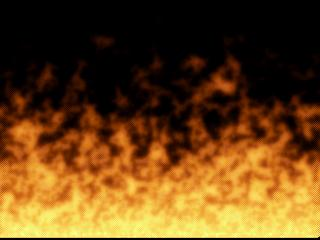



## Fullscreen, Realtime fire\!\!

### Description

Well, it has been a while since I posted anything on here. I finally rewrote some of the code to my previous fire examples and managed to increase the speed of the program by roughly 40-50%. This has allowed me to create a fullscreen effect WITHOUT using DirectX. I did use DirectX just to change the screen resolution, so you will need DirectX to run this. I really hope you enjoy this. Please read the README FIRST file before compiling. This should answer a lot of your questions. The program is currently set to run in 32-bit color, but you can change it to 16-bit if you have problems (constant at beginning of code). 16-bit runs faster. Also, please come back and vote or at least tell me what you think. If you let the fire run for a little while, it will look better. So don't just run it for a second and quit. I may eventually write this in DirectX which should be even faster than this. You need the .pal files in the same directory as the exe. (They hold the colors to use) If there is enough demand, I may release code that will generate these for you.
 
### More Info
 
Make sure you read the README FIRST.txt before compiling the code.

None known

             |
---                |---
**Submitted On**   |2003-03-15 17:45:24
**By**             |[Odin](https://github.com/Planet-Source-Code/PSCIndex/blob/master/ByAuthor/odin.md)
**Level**          |Advanced
**User Rating**    |4.7 (14 globes from 3 users)
**Compatibility**  |VB 5\.0, VB 6\.0
**Category**       |[Graphics](https://github.com/Planet-Source-Code/PSCIndex/blob/master/ByCategory/graphics__1-46.md)
**World**          |[Visual Basic](https://github.com/Planet-Source-Code/PSCIndex/blob/master/ByWorld/visual-basic.md)
**Archive File**   |[Fullscreen1560113152003\.zip](https://github.com/Planet-Source-Code/odin-fullscreen-realtime-fire__1-44032/archive/master.zip)

### API Declarations

Several, look in the code.

